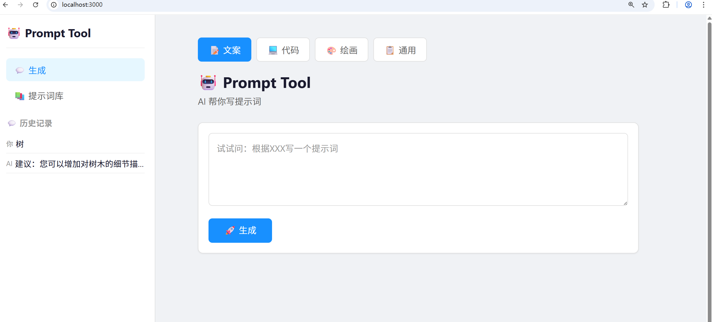

# Prompt Tool 🤖

AI 提示词生成工具。输入需求，AI 帮你写出结构化提示词。

## 功能

- 4 种分类场景生成提示词（文案 / 代码 / 绘画 / 通用）
- AI 先分析需求再输出，完整回复和精简版独立展示
- 提示词词库：保存 / 编辑 / 删除 / 分类浏览
- 词库分类走 URL 参数 (`/library?category=code`)
- 对话历史记录自动保存，刷新不丢失
- 侧边栏分类快捷导航
- 编辑弹窗组件复用（词库页面和分类浏览共用）

## 技术栈

- Nuxt 4 + Vue 3 + TypeScript
- DeepSeek API
- vue-sonner（Toast 通知）
- CSS 变量设计系统

## 本地运行

```bash
git clone https://github.com/你的用户名/prompt-tool
cd prompt-tool
npm install
```

在项目根目录创建 `.env` 文件：

```
DEEPSEEK_API_KEY=你的key
```

启动：

```bash
npm run dev
```

## 项目结构

```
app/
  app.vue            # 侧边栏 + 路由布局
  pages/
    index.vue        # 首页：生成提示词
    library.vue      # 词库：分类浏览 / 编辑
  components/ui/     # 复用组件
    AppButton.vue
    AppCard.vue
    AppTextarea.vue
    EditPromptModal.vue
  composables/       # 组合式函数
    useStorage.ts    # localStorage 响应式封装
    useHistory.ts    # 历史记录共享
server/
  api/
    chat.post.js     # AI 对话 + 提取精简版
```

## 截图


